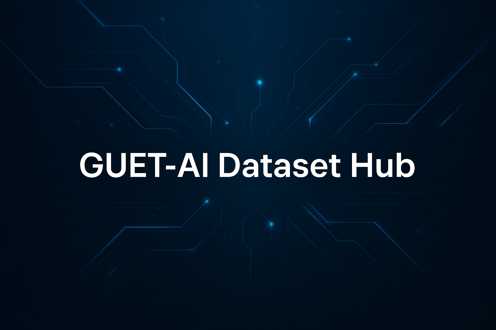

<p align="center">
  
</p>

<p align="center">
  <strong>简体中文 🀄</strong> ｜ English 🌎（即将上线）
</p>

<p align="center">
  👉 欢迎教师与学生上传共享数据集，共建 GUET-AI 数据生态！
</p>

---

## 👋 欢迎访问 GUET-AI 数据集平台

在这里，您可以浏览和获取由桂林电子科技大学师生整理与贡献的各类人工智能方向的高质量数据集。

平台致力于为 AI 研究者提供统一格式的公开数据资源，并持续收录文本、图像、音频、时序等多模态领域的经典与新兴数据集，支持分类检索与高效下载。

您可以：
- ✅ 浏览标准化数据集目录和元信息说明
- ✅ 下载完整数据集资源包
- ✅ 提交并共享您的自建或整理数据集

我们希望通过平台，帮助更多研究者高效查找、获取和复用 AI 相关数据资源，推动科研协作与开放共享。

---

## 📥 上传方式

欢迎通过以下方式上传您的数据集资源：

- ✅ [点击填写数据集提交表单](https://github.com/GUET-AI-Hub/AI-Datasets/issues/new?template=create_dataset.yml)
- ✅ Fork 本仓库 → 上传数据集文件夹 → 提交 Pull Request
- ✅ 将数据打包上传至网盘并通过表单/邮箱提交链接，由平台协助上传

📁 推荐目录结构如下：

```
Dataset_姓名_关键词
├── README.md # 数据集说明
├── data/ # 数据文件（可为 CSV、图像、文本等）
├── LICENSE # 授权协议（建议使用 CC-BY）
└── metafile.yml # 元信息文件（可选）
```


📘 不熟悉 Git 操作？  
👉 [点击查看 Fork + PR 上传详细说明](https://github.com/GUET-AI-Hub/.github/blob/main/profile/help%20doc.md)

---

## 📮 联系方式

如您有任何建议或希望上传数据集资源，请联系平台管理员：

- 👤 管理员：王学敏  
- 📮 邮箱：<wangxuemin@guet.edu.cn>  
- 🔗 GitHub主页：[GUET-AI-Hub](https://github.com/GUET-AI-Hub)

---

<div align="center">
  <sub>由 GUET-AI-Hub 维护 · 构建开放共享的人工智能数据资源生态</sub>
</div>
